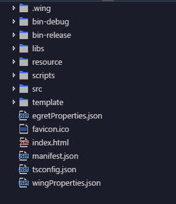
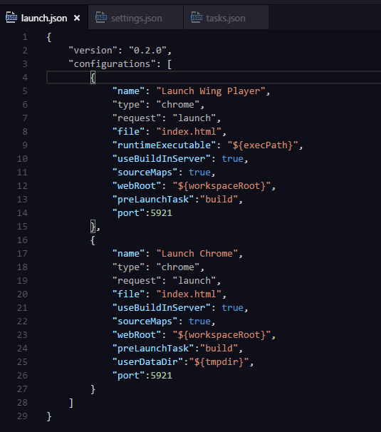
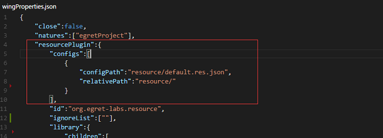
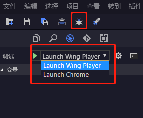
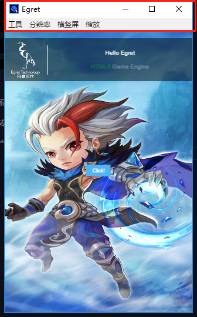
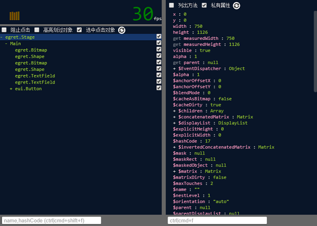
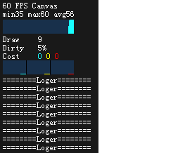
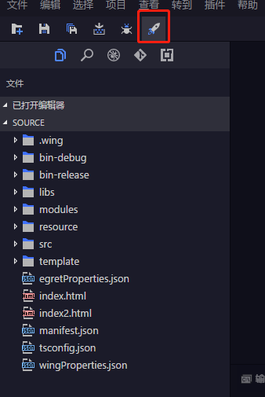
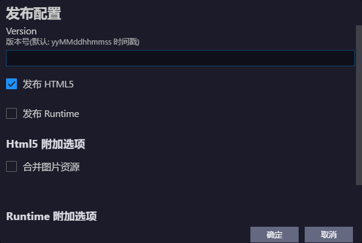

# Erget快速入门

## 写在最前面

- 文章诞生的背景是在汽车城游戏项目组工作半年多的收获

- 作者完全是从纯小白的心态来讲解相关知识点，希望能帮助对 Egret 感兴趣的同学快速入门~

## 介绍

- 汽车城是汽车之家 App 上一款类似梦想小镇的游戏，定期会举办精彩的活动，欢迎大家参与！（广告打完了，进入正题~）。
- 汽车城采用 Egret （白鹭）引擎进行开发，Egret 是目前比较火的 HTMl5 游戏引擎。全球最大的 HTML5 一站式移动技术和服务提供商，致力于为移动互联网全行业提供技术解决方案与服务，携手行业伙伴共建开放、务实、繁荣的HTML5移动生态系统。编程语言采用 TypeScript 。支持 2D 、3D  、PC 端、手游、微信等 h5 小游戏的开发。

## 环境安装

- 下载安装包：从 Egret 官网[下载中心](http://egret.com/downloads/engine.html)下载与操作系统对应的Egret一键安装包。Windows 和 Mac 然后常规安装即可。
- 打开 EgretLauncher ，选择“引擎”进行下载，一般推荐安装最新稳定版
- 写代码还需要安装官方编辑器- Egret Wing ，在 EgretLauncher  选择“工具管理”，下载安装即可。

## 创建项目

- Egret 项目创建可以分为以下几种方式：
  - 通过命令进行创建，[详情看这里](http://developer.egret.com/cn/github/egret-docs/Engine2D/projectConfig/cmdManual/index.html)
  - 通过 EgretLauncher 进行创建，[详情看这里](http://developer.egret.com/cn/github/egret-docs/Engine2D/getStarted/helloWorld/index.html#h3-u521Bu5EFAu9879u76EE)
  - 通过 Egret Wing 编辑器进行创建：
    - 打开编辑器，选择“文件”下的“新建项目”，会弹出一个选择框
    - 按照需要进行选择，这里选择“ Egret 游戏项目”
    - 弹出项目初始化面板，填写“项目名称”，其他默认设置
    - 点击“创建”，等一会儿，就成功创建了一个“ Hello World ” 了啦
    

## 目录说明

- 通过上面的第三种方式，我们创建了一个 Egret 项目，目录结构如下：

  
  - .wing 目录存放编辑器配置，launch.json 文件，需要说明下：

    
    - 这个文件是配置浏览器或者应用窗体启动的相关信息；
    - 有两个参数需要重点说明下：
      - port ：指定端口
      - file ：指定打开的文件名，后面可以带 url 参数
    - 其他参数有兴趣也可以研究下，注意这里 configurations 属性是个数组，是可以配置多个启动方式的
  - bin-debug 调试模式时，这里会生成由 TS 编译出的 JS ，用处当然是调试啦~
  - bin-release 发布完成后会在这个文件夹的 web 文件夹下生成产品代码
  - libs 默认引入的库文件和开发者自己引入的库文件 - 在子文件夹 modules 中
  - resource 资源文件夹：（这个文件夹可以自定义，后面会讲到，重点说明下面文件）
    - assets 文件夹：多媒体资源（图片，视频等）
    - eui_skins 文件夹：自定义皮肤 （ exml 文件）
    - default.res.json：具体资源引用和资源分组，多人开发很容易冲突，后面会讲到如何解决
    - default.thm.json：皮肤需要在这里注册，调试时会通过注册的路径寻找对应的皮肤，发布时会把对应路径的皮肤写入到发布后的这个文件中，是 All in One 哦
  - scripts 第三方相关的东西（目前不需要关注）
  - src 项目源码 （下面 *重要代码说明* 有详情~）
  - template 发布相关（需要关注下面的 web 文件夹）：
    - web 存放发布时 h5 游戏的入口页，注意这个页面是用来发布的，开发时使用根目录下的 index.html 页面，所以有必要保持二者的同步
  - egretProperties.json 模块版本配置，[详情](http://developer.egret.com/cn/github/egret-docs/Engine2D/projectConfig/modelconfig/index.html)
  - index.html 入口文件模板，入口相关配置可以在这里进行修改，[详情](http://developer.egret.com/cn/github/egret-docs/Engine2D/projectConfig/tempfile/index.html)
  - manifest.json 项目所需的所有 javascript 文件的路径存放在这里，不需要手动修改，调试和发布时会自动生成
    - " initial "中是库文件列表，包括 Egret 核心库和其他扩展库
    - " game " 中是项目代码文件列表
  - tsconfig.json 是 Typescript 项目的配置文件，TypeScript 编译器编译代码之前，会首先读取这个配置文件，并根据其中的属性来设置 TypeScript 项目的编译参数，[详情](http://developer.egret.com/cn/github/egret-docs/Engine2D/projectConfig/tsconfig/index.html)
  - wingProperties.json 资源读取配置文件：
    - 资源编辑器基于 wing 项目，需要从项目的配置文件 wingProperties.json 中读取资源配置。打开 wingProperties.json ，在 resourcePlugin -> configs 下加入自己的资源文件：
    

## 重要代码说明

- index.html

  ```html
    <div style="margin: auto;width: 100%;height: 100%;" class="egret-player"
         data-entry-class="Main"
         data-orientation="auto"
         data-scale-mode="noScale"
         data-frame-rate="30"
         data-content-width="480"
         data-content-height="800"
         data-show-paint-rect="false"
         data-multi-fingered="2"
         data-show-fps="true" data-show-log="false"
         data-log-color="#b0b0b0">
     </div>
  ```

  - data-entry-class：文件类名称
  - data-orientation：旋转模式
  - data-scale-mode：适配模式
  - data-frame-rate：帧频数
  - data-content-width：游戏内stage宽
  - data-content-height：游戏内stage高
  - data-show-pain-rect：是否显示脏矩形区域
  - data-multi-fingered：多指最大数量
  - data-show-fps：是否显示fps
  - data-show-log：是否显示egret.log的输出信息
  - data-show-fps-style：fps面板的样式。支持5种属性，x:0, y:0, size:30, textColor:0xffffff, bgAlpha:0.9

  ```javascript
    egret.runEgret({ renderMode: "webgl", audioType: 0 }) //启动项目
  ```

  - 参数是一个对象，包括以下4个可选属性：
    - " renderMode ": 引擎渲染模式，" canvas " 或者 " webgl "
    - " audioType ": 使用的音频类型，0:默认，2: web audio ，3: audio
    - " antialias ": WebGL 模式下是否开启抗锯齿，true :开启，false :关闭，默认为 false
    - " retina ": 是否基于 devicePixelRatio 缩放画布

- AssetAdapter.ts 解析素材的类，在 Main.ts 中进行调用
- LoadingUI.ts 绘制加载进度条的类，在 Main.ts 中进行调用
- Platform.ts 平台数据接口，在 Main.ts 中进行调用
- ThemeAdapter.ts 解析主题的类，在 Main.ts 中进行调用
- Main.ts 入口类

```typescript
    // 在游戏中，用户可以切换应用的前后台。在用户进入后台时，关闭游戏逻辑、渲染逻辑、背景音乐
    egret.lifecycle.addLifecycleListener((context) => {
        // 针对不同的游戏运行环境，开发者可以对生命周期管理器进行扩展，以手机QQ举例
        document.addEventListener("qbrowserVisibilityChange", function(e:any){
          if (e.hidden){
              context.pause();
          } else{
              context.resume();
          };
        });
        // 方法二：在每一帧进行判断
        context.onUpdate = ()=> {
          // 手机QQ注册了 appInBackgound 这一变量
          if (window.appInBackgound){
              context.pause();
          } else{
              context.resume();
          }
        }
    })

    egret.lifecycle.onPause = () => {
      console.log("app 进入后台");
      egret.ticker.pause(); // 关闭渲染与心跳
    }

    egret.lifecycle.onResume = () => {
      console.log("app 进入前台");
      egret.ticker.resume(); // 打开渲染与心跳
    }
```

## 调试

- 有图有真相

  
  - 如图小红框 debug 启动按钮，在开发过程中经常会用到这个功能；
  - 如图大红框，是选择调试模式；
    - Chrome 调试模式也就是浏览器调试，这个模式的好处是和前端调试 web 页面体验差不多，不同之处在于这里所有的绘制是在 Canvas 中进行的，所以查看不到对应元素（这里叫层级），要查看层级需要借助浏览器插件（开发中我没有用到这个插件，这里就不介绍了~）。
    - Wing Player 调试模式也就是窗体调试，也是推荐使用的调试模式，功能强大，容我款款道来~，如图：

      
      - 画框处是启动后的工具栏，里面包含如下选项：
        - 刷新：用于刷新界面，需要注意的有两点：

          1. 常规操作是做了修改后就重新启动窗口；
          2. 修改 exml 文件时，不需要编译，直接刷新就可以生效；
          3. 修改 TS 源码，可以不用关闭窗口，需要编译完成后，刷新界面修改也生效，可是在代码里打的断点会错位；

        - 切换开发者工具：打开了浏览器开发者工具，用的最多是查看网络和性能检测；
        - 切换显示列表查看器，如图：

          
          - 查看对应层级的属性，位置，子元素等
          - 通过界面点击找到左边对应的层级
        - 前置窗口：设置窗口始终在最前面；
        - 关闭：关闭窗口啦~

- 使用 DEBUG 编译参数
  - 在发行版生成过程中，Egret 命令行会移除 if(DEBUG){ ... } 这一整个代码块，保持发行版包体的精简
  - Egret 还提供了另外一个与 DEBUG 对应的编译参数 RELEASE，用来编写只在发行版中运行的代码

  ```typescript
  if (DEBUG) {
          var rect = value.split(",");
          if (rect.length != 4 || isNaN(parseInt(rect[0])) || isNaN(parseInt(rect[1])) ||
              isNaN(parseInt(rect[2])) || isNaN(parseInt(rect[3]))) {
              egret.$error(2016, this.currentClassName, toXMLString(node));
          }
      }
  ```

- 使用内置日志输出面板
  - 在 index.html 文件中有如下代码块：

  ```html
    <div style="margin: auto;width: 100%;height: 100%;" class="egret-player"
         data-entry-class="Main"
         data-orientation="auto"
         data-scale-mode="noScale"
         data-frame-rate="30"
         data-content-width="480"
         data-content-height="800"
         data-show-paint-rect="false"
         data-multi-fingered="2"
         data-show-fps="true" data-show-log="false"
         data-log-color="#b0b0b0">
     </div>
  ```

  - 通过 data-show-log： 设置是否在屏幕中显示日志。 true 显示，false 不显示，默认在屏幕左上角
  - 在代码中可以直接调用 egret.log(message?:any, ...optionalParams:any[]) 来输出日志
  - 如图：
   

## 发布

- HTML5 打包发布：

  - 点击如图所示的按钮

  

  - 出现下图弹框
  
  

  - 版本号，生成的目录文件夹名称
  - 选择发布成的项目类型，这里选择 HTML5
  - 是否合并图片资源。如果选中，则会自动合并项目里的图片
  - 点击确定后，会在项目的发布目录里生成对应版本的文件夹
  - 将发布完的文件夹放到服务器上，访问 index.html 即可
  - 也可以通过 egret release [版本号] 进行发布

- [打包 Android app](http://developer.egret.com/cn/github/egret-docs/Engine2D/publish/publish/index.html#h2-3-android-app)
- [打包 IOS app](http://developer.egret.com/cn/github/egret-docs/Engine2D/publish/publish/index.html#h2-4-ios-app)

## 坑~

  1. Wing 编辑器编译速度会越用越卡~
  2. 有些报错不会显示，需要单步调试一步步跟
  3. 窗体调试器只能打开一次，下次打开需要重新启动项目
  4. 用浏览器模式调试时，某些电脑（比如我的~）第二次刷新浏览器界面会卡死
  5. default.res.json 文件中的雪碧图如有新增，需要把相关的信息全部删除重新添加
  6. default.thm.json 文件自定义皮肤如果没有在这里注册，会出现相关界面不显示，项目也不报错的尴尬情况
  7. default.res.json 文件多人开发容易冲突，可以通过给资源建立组来避免，如果还是有冲突，需要有个主程和进行合并
  8. 发布时合并图片资源有讲究，容易形成性能问题，我们采用的方式是发布时不合并，在开发时进行合并，一个功能点一张雪碧图
  9. 更新代码时如果其他同事增加了图片，编辑器会显示有新增图片，是否自动保存，一定要点否！因为点击是的话会把这个图片存到默认组里，一来会有冲突，而是不利于资源优化

## 寄语

如今小游戏火遍天下，作为前端开发的同学们也可以利用这一有利条件，做属于自己的小游戏，一份耕耘一份收获哟~
