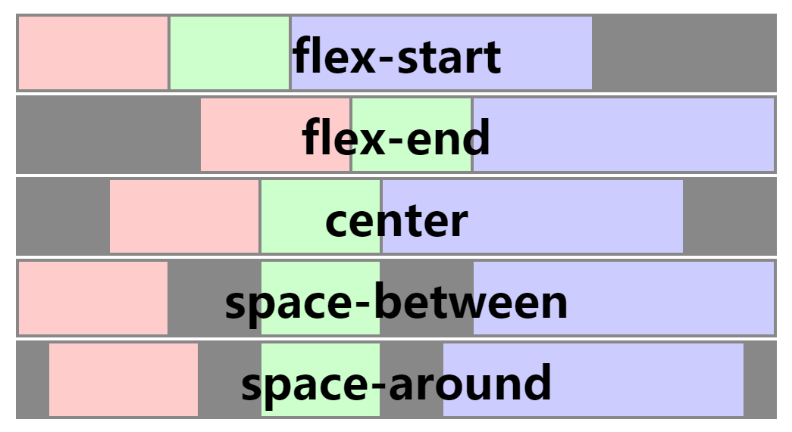
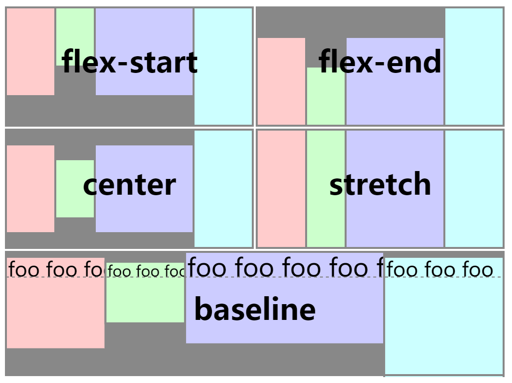
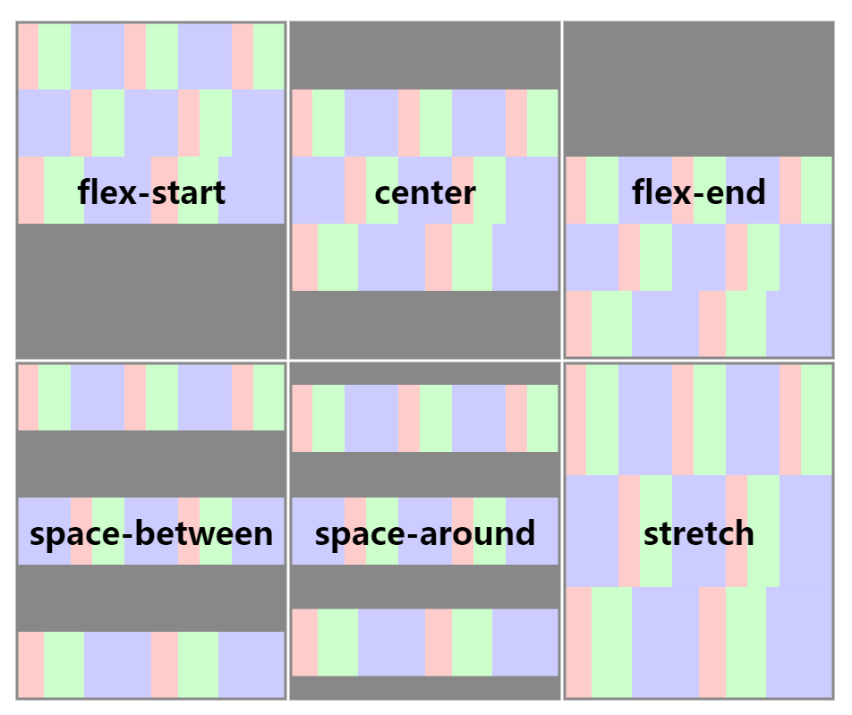
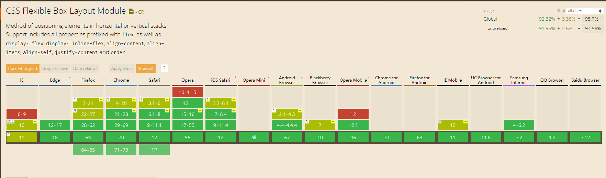

## 你是谁？从哪里来？到哪里去？”

1. 我是“伸缩布局”（英文名：display: flex）
2. 为了呈现复杂的应用与页面而被设计出来的
3. 我也不知道要到哪里去...

## 引子

伸缩布局相信大家早并不陌生，之所以还要背书，是因为在我个人看来虽然知道怎么用，但是真正的用起来次数还是少的可怜（至少我是这样）， Why？思维定式

比如：我明明可以用 float 实现的为啥要用 flex ？我明明可以用 inline-block 实现的为啥要用 flex ？那来那么多明明，用 flex 简单啊~

如图1：


html:

```html
<ul>
  <li></li>
  <li></li>
  <li></li>
  <li></li>
  <li></li>
</ul>
```

float 实现

```css
ul {
    width: 550px;
}

li {
    float: left;
    width: 100px;
    height: 100px;
    background-color: #795548;
    margin-right: 10px;
}
// 此处省略清除浮动副作用和保证不换行需要手动清除最后一个 li 的 margin-right 的代码
```

inline-block 实现

```css
ul {
  width: 550px;
  font-size: 0;
}

li {
  display: inline-block;
  width: 100px;
  height: 100px;
  background-color: #795548;
  margin-right: 10px;
  // 若内容有可能溢出还需要 vertical-align: top;
  // 防止换行要么 white-space: nowrap; 要么清除最后一个元素的 margin-right
}
```

flex 实现

```css
ul {
  width: 550px;
  display: flex;
  justify-content: space-between;
}

li {
  width: 100px;
  height: 100px;
  background-color: #795548;
}
```

## justify-content 属性 - 水平对齐

适用于：伸缩容器，也就是设置了 `display: flex` 的元素，会对齐子元素产生影响，这个属性不可继承

属性值有：

- flex-start （默认值）：所有子元素靠左对齐
- flex-end：所有子元素靠右对齐
  - 还在用 float 或者 inline-block 实现吗？ 试试 flex-end 吧~
- center：所有子元素居中对齐
  - 利用这个原理可以轻松实现元素平均分布哟，但是需要手动设置元素之间的间隔
- space-between：
  1. *官方原话*：伸缩项目会平均地分布在行里。如果剩余空间是负数，或该行只有一个伸缩项目，则此值等效于「flex-start」。在其它情况下，第一个项目在主轴起点边的外边距会与该行在主轴起点的边对齐，同时最后一个项目在主轴终点边的外边距与该行在主轴终点的边对齐，而剩下的伸缩项目在确保两两之间的空白空间相等下平均分布
  2. *我的理解*：
      - （需要显式的宽度）正常情况下所有子元素之间会平分空白，第一个左边没有留白，最后一个右边没有留白
      - 如果子元素溢出或者只剩一项效果相当于 flex-start
      - **当遇到需求需要展示项水平排列，间隔动态变化，只要一个时需要居左**，这个属性就派上用场了
- space-around：
  1. *官方原话*：伸缩项目会平均地分布在行里，两端保留一半的空间。如果剩余空间是负数，或该行只有一个伸缩项目，则该值等效于「center」。在其它情况下，伸缩项目在确保两两之间的空白空间相等，同时第一个元素前的空间以及最后一个元素后的空间为其他空白空间的一半下平均分布
  2. *我的理解*：
      - （需要显式的宽度）正常情况下所有子元素之间会平分空白，第一个左边和最后一个右边的留白为其他留白的一半
      - 如果子元素溢出或者只剩一项效果相当于 center
      - **当遇到需求需要展示项水平排列，间隔动态变化，只要一个时需要居中**，这个属性就派上用场了，但要注意这里需要处理好第一个左边和最后一个右边的留白
  3. 如图2：
  
      
- space-evenly（兼容不好）：
  - 这个属性和 `space-around` 效果差不多，不同点在于每个间隔都是相等的

      

- 还有一个方式也可以解决 **当遇到需求需要展示项水平排列，间隔动态变化，只要一个时需要居中** 这个问题：

```css
ul {
  display: flex;
}

li {
  flex: 1;
  height: 100px;
  display: flex;
  justify-content: center;
  /* 也可以 justify-content: space-around; */
  background-color: #795548;
}

/* 注意：这个方式也有算不上弊端的弊端，就是如果 li 标签里面元素不止一个，就需要额外的元素将其作为其父级 */
```

- **希望读者看完上面介绍后，再遇到上述场景，能第一时间想到它**
- 有图有真相：

  

## align-items 和 align-self 属性 - 垂直对齐

`align-items` 适用于：伸缩容器，也就是设置了 `display: flex` 的元素，会对其子元素产生影响，这个属性不可继承

`align-self` 适用于：伸缩项目，也就是父元素设置了 `display: flex` 的元素，会对其自身产生影响，使父元素的 `align-items` 失效，这个属性不可继承

属性值有：

- flex-start：子元素紧靠父元素上边对齐
- flex-end：子元素紧靠父元素下边对齐
- center：子元素相对于父元素垂直居中
  - 这个可以实现**垂直居中**，即使父元素尺寸比子元素小，子元素也会向两个方向溢出相同的量

  ```css
    /* 实现所有子元素的垂直居中 */
    ul {
      align-items: center;
    }
  
    /* 实现单个元素的垂直居中，即使父元素设置了 align-items 属性时，align-items 也不会生效 */
    li {
      align-self: center;
    }
  ```

- baseline：相对于所有子元素的第一行文字对齐 *（ align-items 和 align-self 很少用到）*
- stretch：为 `align-items` 属性的默认值，该值会拉伸子元素的高度，使其与父元素的内容高度相等，*前提是子元素的高度为 「auto」，不然没有效果*
- *auto：为 `align-self` 属性的默认值，如果值为「auto」，则其值为父元素的「align-items」值*
- *注意：若子元素的任一个垂直方向上的外边距（margin-\*）为「auto」，则「align-self」没有效果*，比如

  ```css
    li {
      align-self: flex-start;
      margin-top: auto;
    }
  ```

  ```css
    li {
      align-self: flex-end;
      margin-bottom: auto;
    }
  ```

- **综上所述怕是我们用到的最多就是 `align-items: center;` 或者 `align-self: center;`**
  - 其实不然，我们可以 `align-items` 属性能覆盖父元素的特性，来单个设置各个子元素的垂直对齐方式，做到随机应变，临危不乱...
  - 还有通过 `stretch` 属性可以实现多个元素高度同步效果
  - 然后我们还可以结合 `justify-content` 和 `align-items` 或者 `align-self` 来实现绝对居中（垂直水平都居中）

- 有图有真相：

  

## 名词解释

多行伸缩容器：多行的伸缩窗口会将其子元素配置在多个伸缩行上，这类似于文本的排列：当文本过宽导致一行无法容纳时，内容会断开并移至新的一行。当用户代理创建新的伸缩行时，这些伸缩行会根据「flex-wrap」属性沿着水平方向进行堆叠。除非伸缩容器本身是空的，每一个伸缩行至少包含一个子元素

单行伸缩容器：单行的伸缩容器会将其所有子元素在单独的一行上进行布局，即便这可能导致内容溢出

我们先来看看*多行伸缩容器*和*单行伸缩容器*是咋出现的？

- flex-wrap 属性 - 伸缩行换行
  - nowrap（默认值）：伸缩容器为单行，大多数情况是从左到右
  - wrap：伸缩容器为多行，大多数情况是从左到右
  - wrap-reverse：伸缩容器为多行，大多数情况是从右到左

由上得知如果不是手动设置，伸缩容器都是单行的，要使伸缩容器成为多行还有个前提就是子元素必须相对于父元素溢出

## align-content 属性 - 堆栈伸缩行

适用于：多行伸缩容器，也就是设置了 `display: flex` 的元素，会对其子元素产生影响，这个属性不可继承

*注意：当伸缩容器的垂直方向还有多余空间时，「align-content」属性可以用来调准伸缩行在伸缩容器里的对齐方式，这与调准伸缩项目在垂直方向上对齐方式的「justify-content」属性类似。请注意本属性在只有一行的伸缩容器上没有效果*，所以下面讨论都是建立在多行的基础上

属性值有（官方描述字有点多，我就翻译下）：

- flex-start：把所有元素看成一个整体，向左上角对齐
- flex-end：把所有元素看成一个整体，向左下角对齐
- center：把所有元素看成一个整体，垂直居中
- space-between：
  - （如果子元素缺少显式的宽或者高，子元素都会被相应拉伸）所有行之间会平分空白，第一行上边没有留白，最后一行下边没有留白
  - **当遇到需求需要展示项多行排列，上下间隔动态变化**，这个属性可以派上用场
- space-around：
  - （如果子元素缺少显式的宽或者高，子元素都会被相应拉伸）所有行元素之间会平分空白，第一行上边和最后一行下边的留白为其他留白的一半
  - **当遇到需求需要展示项多行排列，上下间隔动态变化**，这个属性也可以派上用场
- stretch：
  1. *官方原话*：各行将会伸展以占用剩余的空间。如果剩余的空间是负数，该值等效于「flex-start」。在其它情况下，剩余空间被所有行平分，扩大各行的侧轴尺寸
  2. *我看到的现象*：
      - 当子元素个高度为 auto 时，确实如上所说
      - 当子元素个高度为 为实际值时，其表现和 `space-between` 差不多，不同点在于最后一行也参与了留白平分，相当于每行设置了 `margin-bottom`
  3. **当遇到需求需要展示项多行排列，上下间隔动态变化**，这个属性也可以派上用场
- space-evenly（兼容不好）：
  - 这个属性和 `space-around` 效果差不多，不同点在于每个间隔都是相等的

- 如上所述 `space-between` 、 `space-around` 、 `stretch` 都可以实现**多行排列，上下间隔动态变化**，但是具体使用还需要看实际的场景，清楚各自属性的限制，能帮助我们更好的实现想要的效果
- 有图有真相：

  

## 总结

1. `justify-content` 属性可以轻易实现水平方向的排列布局，所以掌握这个属性在以后的工作中会是一大助力
2. `align-items` 和 `align-self` 属性可以轻易实现垂直方向的排列布局，所以掌握它至少可以轻松实现垂直居中
3. `align-content` 属性可以轻易实现**多行排列，上下间隔动态变化**，你还在等什么？
4. 现在问题来了，如何实现“绝对居中”？
5. 移动端使用这个属性时完全可以的， PC ie10 上支持
6. 这个属性有新老之分，用的时候可以写新的，然后通过工具补全老的兼容写法

## 最后

送上一张兼容性截图

