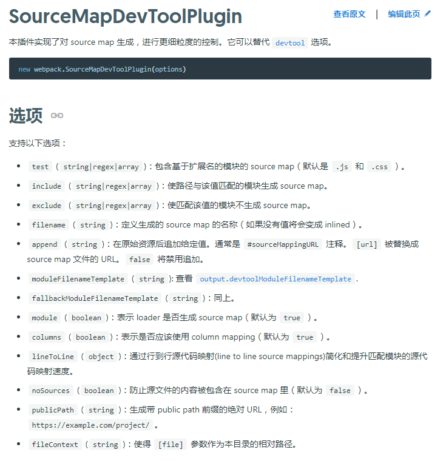

## 写在最前面

我们的项目是使用 Vue2.x 进行开发的，最近引进了 sentry 用来监控线上问题，由于 sentry 可以上传 .map 文件来提示代码报错在源文件的位置，所以我开启（之前是关闭的）了 `productionSourceMap` 选项，用来在编译时输出 .map 文件...

## 现实

默认配置中 .map 文件的输出位置是和源文件在一个目录的（css 默认不输出，所以这里就只有 js ），如下图：


## 理想

把 .map 文件输出到另一个目录中，比如 .sourcemap 。这样不管是把 .map 文件上传到 sentry 还是把代码部署到生产环境都会比较方便，如下图：


## 然而

查遍 Vue CLI 配置项就只发现 `productionSourceMap` 是唯一一个与 .map 文件有关系的配置项，并且还是 Boolean 值，尴尬...，那我还能设置它的输出位置吗？

```txt
productionSourceMap
Type: boolean

Default: true

如果你不需要生产环境的 source map，可以将其设置为 false 以加速生产环境构建。
```

## 想法

能！当然能！官方都说了 Vue CLI 是基于 webpack 构建的，那么去查 webpack 的配置不就可以解决问题，而且凭记忆知道 webpack 是有相应的配置的，比如：

```txt
devtool

此选项控制是否生成，以及如何生成 source map。

使用 SourceMapDevToolPlugin 进行更细粒度的配置。
```

既然文档都说用 [SourceMapDevToolPlugin](https://www.webpackjs.com/plugins/source-map-dev-tool-plugin/) 可以进行更细粒度的配置，那我们就去看看，如图：



可以看出只需要下面四个属性就可以达到目的：

1. test
2. filename
3. publicPath
4. fileContext

## 然后

这是 webpack 的配置，怎么写到 vue.config.js 中呢？当然是查 Vue CLI 的文档咯

### 一个"简单的配置方式"


具体写法如下：

```js
// vue.config.js
let webpack = require('webpack')

module.exports = {
  configureWebpack: {
    plugins: [
      new webpack.SourceMapDevToolPlugin(
        {
          test: /\.js(\?.*)?$/i,
          filename: '.sourcemaps/[filebase].map',
          publicPath: '../',
          fileContext: 'dist',
        }
      )
    ]
  }
}
```

效果如下：


咦~ 怎么 js 文件中还有 .map！
哦~ `productionSourceMap` 选项没有关，那关了试试：


东西呢？

百思不得其解中...

求助大神...

大神不想和我说话并甩了一个 `vue-cli-service inspect` 命令过来，如图：


最后经过对比输出的内容发现  `productionSourceMap` 的开启与否，有几个地方在发生变化，又经过多番尝试，锁定是 `optimization > minimizer > options > sourceMap` 在控制 js 文件的 .map 文件生成，找到关键点了，解决问题也就简单了，改掉这个配置呗，如图：

`productionSourceMap: false`


`productionSourceMap: true`


完整写法如下：

```js
// vue.config.js
let webpack = require('webpack')
let UglifyJsPlugin = require('uglifyjs-webpack-plugin')

module.exports = {
  productionSourceMap: false,
  configureWebpack: {
    plugins: [
      new webpack.SourceMapDevToolPlugin(
        {
          test: /\.js(\?.*)?$/i,
          filename: '.sourcemaps/[filebase].map',
          publicPath: '../',
          fileContext: 'dist',
        }
      )
    ]
  },
  chainWebpack: config => {
    config.optimization.minimizer([new UglifyJsPlugin({
      sourceMap: true
    })])
  }
}
```

## 后记

1. 多看文档，多动手
2. 技术研究是严谨的，技术应用是灵活的