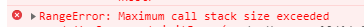

# 写在最前面

- 今天要跟大家分享的知识点名叫：*尾递归调用*，先知道个名儿，读下去知其意

## 问题

- 当在一个函数中调用另一个函数时，系统会重新分配一个*栈帧*来保持这个函数所有状态，这个过程会耗费处理时间和增加额外的内容
- 当我们进行递归编程时（函数重复调用自己或者多个函数相互调用形成递归），调用栈的深度很容易达到成百上千，如果任由其增长，很快计算机就会陷入瘫痪...
- 这个时候 js 引擎不得不采用一个武断的限制来防止上述情况的发生，这也就是为什么会看到*RangeError：Maximum call stack exceeded* 的原因，如图：
  
  - 

## 尾调用

- 尾调用的概念非常简单，是指某个函数的最后一步是调用另一个函，它可以以避免额外分配*栈帧*的方式对函数调用进行优化
- 具体操作就是定义一个 `return` 函数调用的语句，除了调用后返回函数返回值以外其值没有任何多余操作
- 先来一个不是尾调用的函数调用，代码如下：

```js
"use strict"

function foo(x) {
  return x *2;
}

function bar(x) {
  return 1 + foo(x);
}

bar(10); // 21
```

- 可以看到在 `foo(x)` 执行完成后有执行了 `+ 1` 操作，所以 `bar(..)` 的调用状态需要被保留

- 尾调用不是一定要出现在函数尾部，只要保证是最后一步操作就可以，代码如下：

```js
"use strict"

function f(x) {
  if (x > 0) {
    return m(x)
  }
  return n(x);
}
```

## 尾调用优化