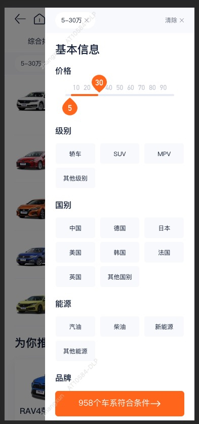
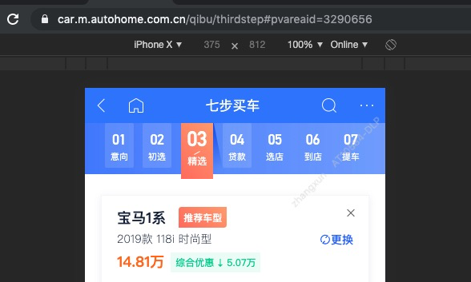

## 有感而发 

本篇文章旨在汇总我工作中遇到的，并解决的问题，希望能帮助大家少踩坑，提升工作效率！给出的解决方案或许不是最佳实践，所以非常欢迎提意见，持续更新中...（由于我们开发使用的是 VUE，所以以下说法大多和 VUE 有关）

## 引用的外部模块打包出来的代码在某些低端机型下报错

- 上述问题我是在本地化和买新车项目中遇到过，究其原因还是使用的包或者包的依赖中提供了 es6 代码，低端机不支持 es6 的语法导致的

- 具体现象就是某一个页面直接白屏，我们是通过搜索转译后 es5 代码中的 `const/let` 发现的这个问题的

- 解决方式是针对 node_modules 里的库做 babel 转译，具体操作是在打包工具的配置文件中加入相关的配置，比如 VUE 的处理方式如下：
    ```js
    module.exports = {
      transpileDependencies: ['swiper'], // swiper 就是一个典型案例～
    };
    ```

## toFixed 四舍五入的坑

- 我们都知道 toFixed() 方法可把 Number 转化为指定小数位数的数字，

- 但是有一个经常会忽视的地方，那就是它会在转化过程中进行末尾数字四舍五入，比如：

  ```js
  Number(6.66).toFixed(2) // "6.66"

  Number(6.666).toFixed(2) // "6.67"
  ```

- 那问题来了，我不想四舍五入可不可以？

- 当然可以！但是由于它没有参数去处理四舍五入问题，所以我们就需要自己封装一个函数；

- 在动手之前我还特意在网上查了一遍看看有没有合适的，说啥的都有，就是没有合适的，我就自己写了，代码如下：

  ```js

  /**
   * 数字格式化
   *
   * @param {number} num 准备转换的数字
   * @param {number} n 小数的位数
   * 
   * @returns {string} 格式化的数值
   */
  function formatAbsNum(num, n = 2) {
    const abs = Number(num).toFixed(n + 1);
    return abs.slice(0, abs.length - 1);
  }

  ```

## 100vh 在 ios Safari 上会把地址栏高度和工具栏高度算进去

- 这个问题其实很简单，之所以写一下是因为出现这个问题后，若没有这方面经验，一时间完全是没有头绪，很浪费表情

  

- 如上图，底部的内容会在 IOS 某些系统中被截调一部分，这里设置的显式高度就是 100vh，我们通过 alert 的结果是，这时的元素高度为内容区 + 地址栏 + 工具栏的高度，所以导致了显示问题

- 解决方式也很简单：不用 vh，换一种方式实现

## 使用 vue-lazyload 的图片切换，图片不更新问题

- 这个问题在 tab 列表页中比较常见，初次遇到会让人没有头绪；原因是在元素渲染完成后，我们和元素绑定的值被赋给了 img 的 src，此后便断开了之间的联系，导致元素无法更新，这样图片也就不会再更新了

- 解决方式是给整个块或者 img 增一个 key 属性，这样 VUE 在更新时就会根据数据的变化去触发元素的更新

## navigator.geolocation.getCurrentPosition 超时问题

- 这是在开发买新车时遇到的一个问题，具体表现是在某些手机上如果定位功能没有开，那么 `navigator.geolocation.getCurrentPosition` 就会一直处于等待状态，导致后面的代码不执行；我怎么发现的呢？当时把显示页面的代码放在了这个函数之后，导致了在华为 mate 系列上的白屏问题...

- 解决方式是手动给这个函数传入一个超时时间，比如：

  ```js
   navigator.geolocation.getCurrentPosition(
     (position) => {
       const { longitude, latitude } = position.coords;
       success(longitude, latitude, resolve);
     },
     (error) => {
       fail(error, reject);
     },
     { timeout: 3000 }, // 超时时间 3 秒
   );
  ```
- 当然上面说的逻辑问题，发现后调整了顺序就没有再复现了

- 这里还要多嘴说一句的是：获取经纬度这个功能我们不能把它当作是一个强需求，只能作为一个附加功能来看待，因为从前端角度来说我们是无法知道用户有没有开定位，一旦获取定位失败功能就挂掉了，这会很尴尬，况且后端也是可以获取经纬度的，就看你怎么谈了～

## router-link 使用 exact 参数，当路由带参数时高亮匹配不到

- 这个问题是当时做七步买车时遇到的，由于七步买车里有按照路由显示的导航，所以就要求导航跟着路由一起变化，如图：



- 问题在于当 url 里没有参数时，exact 参数完全可以满足需求，代码如下：

  ```html
  <router-link to="/" exact></router-link>
  ```

- 但是当 url 里有参数时，exact 参数就完全失效了，

- 解决方式是使用 js 判断路由 name，代码如下：

```js
<router-link
  v-for="item in routers"
  :key="item.id"
  :to="item.to"
  :replace="replace"
  :class="{activate: item.name === $route.name}"
>{{ item.title }}</router-link>

```
