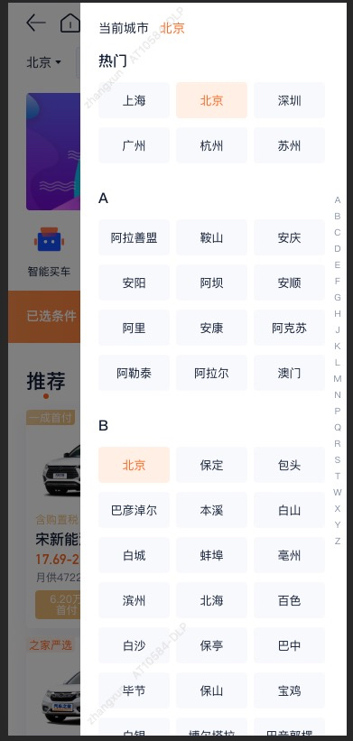
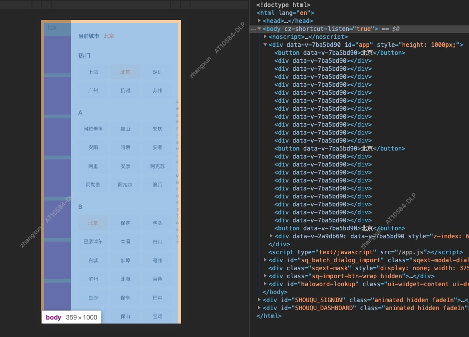
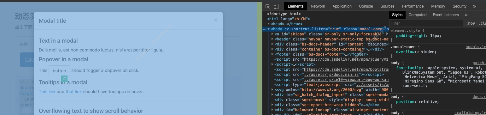

## 背景

- 工作中我们经常会遇到需要开发一个对话框或者半浮层这样的组件，如果工程中引入了 UI 库，那这些工作通常我们是不需要做的；但是如果是一个简单的页面，我们就需要亲自动手了，当你高高兴兴的完成并提测后，如图：

  

- 过一会儿，测试小妹妹跑来给你说有个地方不合适需要调一下...（这么简单的功能还有问题？怀疑人生中...）

  

## 问题 (what)

- 这里出现的问题是：当手指在浮层上滑动或者鼠标在浮层上滚动时，浮层下的内容也会随着一起上下滚动

  

## 探究 (why)

- 现在我们开始探究为什么会出现这个问题：
  1. 谁在滚动？
  2. 什么原因滚动？

  

- 由图可以看出是 body 在滚动，那第一个问题已经有了答案，这个滚动元素就是 body；
- 再看图又发现整个组件都是在 body 中的，它就是 body 的子元素，那当然在组件中的操作大部分都会传播到 body，这就是为什么 body 也会跟着滚动了的原因了

## 方案 (how)

- 现在我们知道了滚动的原因，那么接下来就着手去解决它吧！

  1. 先从组件本身考虑，这个问题是浮层导致的，那么我们是不是把浮层的默认操作禁掉，这个问题是不是就迎刃而解了？
   
      - 由于我开发用的 VUE 所以这里的处理就是用的 VUE 的处理方式，大家明白这个思路即可

      - 这里的示例代码都是出自我贡献的[移动端城市切换组件，欢迎下载](http://npm.corpautohome.com/package/@auto/pc-city-select)

      - 如下代码：

      ```html
        <div class="mask" @touchmove.prevent></div>
      ```
      - 然而事情没有想象的那么简单，问题依旧！此路不通啊

  2. 从滚动的元素 body 考虑，那我们让 body 不动，不就解决问了嘛？其实细心去看看各大框架或库就可以知道大家都是在 body 上做文章，比如 bootstrap、vant、element 等，下面放上 bootstrap 的截图：

      
      - 答案呼之欲出：给 body 设置 `overflow: hidden;`，也就是在组件显示时设置，隐藏时取消，代码如下：

      ```js
      if (visible) {
        document.body.style.overflow = 'hidden'
      } else {
        document.body.style.overflow = ''
      }
      ```

      - 然而问题还是没有解决...，上面方案在手机两端完全失效

  3. 于是紧皱眉头把 1 和 2 的方案结合在了一起，正确答案又再一次呼之欲出：
      - 给 body 设置 `overflow: hidden;` 
      - 阻止浮层的冒泡

  4. 按照以上方式虽然解决了问题但是还是有点小瑕疵：就是滚动到底后还是会使页面整体闪烁一下

  5. 展示黑科技，代码如下：

  ```js
    // e 是当前元素的事件对象
    // 解决思路就是：既然滚动到底或顶才会出现问题，那就不然他滚到底或顶就可以了～（有聪明的同事真好）
    if (scrollTop === 0) {
      e.target.scrollTop = 1
    }
    if (scrollTop === e.target.scrollHeight - e.target.offsetHeight ) {
      e.target.scrollTop = e.target.scrollTop - 1
    }
  ```

  6. 到此问题已经解决，如有错误，欢迎指正～

## 多说一点

- 组件的半透明层最好是一个单独的元素，并且和内容元素是兄弟关系，这样可以避免很多意想不到的问题，这里之所以提一下这个，是因为我之前就踩过这个坑，当时想着用一个伪类实现多么高大尚啊，毕竟其他库都是单独的一个元素，想想还有点小激动

- 事实是大家这么写是有原因的，这样写在 pc 上表现正常，但是移动端形同虚设

## 鸡汤一下

- 以后再遇到类似情况你该知道怎么做了吗？当然我不是单单只解决这个问题的方案，还有遇到分析问题，并最终解决问题的方式：先 what，然后 why，再 how，按照这个顺序一直循环下去，直到把问题全部拆解、解决...，然后...升职加薪指日可待